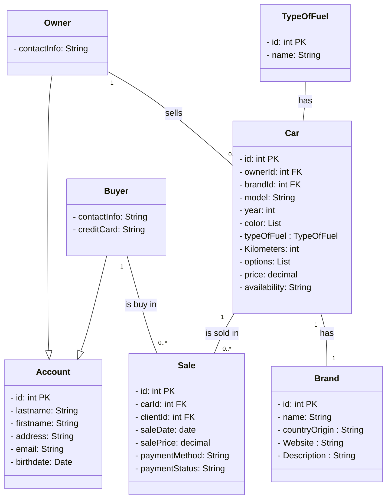

# 63-41-implementing-services-jakarta

HES-SO School Project

## class diagram

```mermaid
classDiagram

class Account {
    - id: int PK
    - lastname: String
    - firstname: String
    - address: String
    - email: String
    - birthdate: Date
}

class Owner {
    - contactInfo: String
}
Owner --|> Account
Owner "1" -- "0..*" Car : sells


class Buyer {
    - contactInfo: String
    - creditCard: String
}
Buyer --|> Account
Buyer "1" -- "0..*" Sale : is buy in

class Car {
    - id: int PK
    - ownerId: int FK
    - brandId: int FK
    - model: String
    - year: int
    - color: List<String>
    - typeOfFuel : TypeOfFuel
    - Kilometers: int
    - options: List<String>
    - price: decimal
    - availability: String
}
Car "1" -- "0..*" Sale : is sold in
Car "1" -- "1" Brand : has

class Sale {
    - id: int PK
    - carId: int FK
    - clientId: int FK
    - saleDate: date
    - salePrice: decimal
    - paymentMethod: String
    - paymentStatus: String
}

class Brand {
    - id: int PK
    - name: String
    - countryOrigin : String
    - Website : String
    - Description : String
}

class TypeOfFuel {
    - id: int PK
    - name: String
}
TypeOfFuel  --  Car : has

```